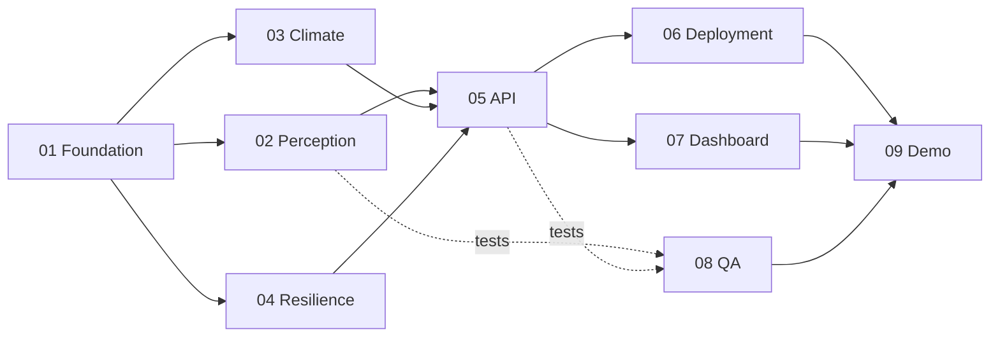

# HotSpot Sentinels — Epic Catalogue

Every epic required to take this project from an empty workspace to a submitted hackathon entry. Each document is the authoritative scope for its epic; [COPILOT_GUIDE.md](../../COPILOT_GUIDE.md) remains the authority on technical constraints and the Heat Analysis Result schema.

## Epics

| Epic                                                      | Title                                    | Delivers                                       | Depends on | Status      |
| --------------------------------------------------------- | ---------------------------------------- | ---------------------------------------------- | ---------- | ----------- |
| [EPIC-01](./epics/EPIC-01-foundation-environment.md)      | Foundation & Environment                 | GCP provisioning, `.env`, deps, package layout | —          | In progress |
| [EPIC-02](./epics/EPIC-02-multimodal-perception.md)       | Multimodal Perception & Gemini Reasoning | `vision_analyzer.py`, `seed_samples.py`        | 01         | In progress |
| [EPIC-03](./epics/EPIC-03-climate-telemetry.md)           | Climate Telemetry & Ingestion            | `climate_service.py`                           | 01         | Not started |
| [EPIC-04](./epics/EPIC-04-resilience-pipeline.md)         | Event-Driven Resilience Pipeline         | `database.py`, `alert_dispatcher.py`           | 01         | Not started |
| [EPIC-05](./epics/EPIC-05-api-service.md)                 | FastAPI Core Service & Controller        | `main.py`                                      | 02, 03, 04 | Not started |
| [EPIC-06](./epics/EPIC-06-containerization-deployment.md) | Containerization & Cloud Run Deployment  | `Dockerfile`, live service                     | 05         | Not started |
| [EPIC-07](./epics/EPIC-07-dashboard.md)                   | Interactive Dashboard & Heat Visualizer  | `frontend/app.py`                              | 05         | Not started |
| [EPIC-08](./epics/EPIC-08-quality-assurance.md)           | Quality Assurance & Test Coverage        | `tests/`, coverage reports                     | 02–07      | Not started |
| [EPIC-09](./epics/EPIC-09-demo-submission.md)             | Demo, Documentation & Submission         | README, demo runbook, submission               | 06, 07, 08 | Not started |

## Dependency graph



EPIC-08 runs alongside 02–07 rather than after them — tests are written in the same sprint as the code they cover, not retrofitted at the end.

## Traceability to the original backlog

[Epics_Stories.md](../../Epics_Stories.md) defined five build epics. This catalogue keeps all of them and adds the four an end-to-end delivery needs.

| Original                           | Here                                                                  |
| ---------------------------------- | --------------------------------------------------------------------- |
| Epic 1 Multimodal Perception       | EPIC-02                                                               |
| Epic 2 Climate Telemetry           | EPIC-03                                                               |
| Epic 3 Event-Driven Pipeline       | EPIC-04                                                               |
| Epic 4 FastAPI Service (Story 4.1) | EPIC-05                                                               |
| Epic 4 Docker (Story 4.2)          | EPIC-06, expanded to cover deploy, IAM and verification               |
| Epic 5 Streamlit UI                | EPIC-07                                                               |
| —                                  | EPIC-01 Foundation, implied by `setup_gcp.sh` but never scoped        |
| —                                  | EPIC-08 QA, required by the coverage reporting in the sprint workflow |
| —                                  | EPIC-09 Demo & submission, the actual hackathon deliverable           |

## How these feed the sprint workflow

Each epic document ends with a **Seed the backlog** block of `backlog.py` commands. Run them in epic order so the generated IDs line up with the document numbers — doc `EPIC-01` becomes backlog `EPIC-001`.

```bash
python3 .github/skills/agile-sdlc-loop/scripts/backlog.py init
# then paste each epic's seed block, in order
python3 .github/skills/agile-sdlc-loop/scripts/backlog.py list
```

After seeding, run `/agile-sdlc-loop sprint` to groom, plan, and deliver one sprint at a time.

## Status vocabulary

| Status      | Meaning                                                                             |
| ----------- | ----------------------------------------------------------------------------------- |
| Not started | No code exists                                                                      |
| In progress | Code exists but acceptance criteria are unmet — see the epic's known gaps           |
| Done        | Every story's acceptance criteria demonstrated, tests passing, contract audit clean |

Nothing is `Done` until EPIC-08's tests cover it. Code that exists is not code that works.
