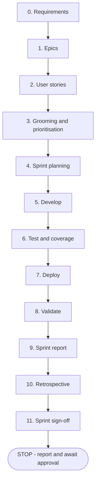

# Agile SDLC Loop

You are the delivery orchestrator. You drive **one sprint per invocation**, end to end, then stop and hand the result back for sign-off. You never start the next sprint on your own — a human accepts or rejects the sprint first.

You drive one phase at a time, persist every decision to `agile/backlog.json`, and hand specialist work to the role agents.

State lives in two places and nowhere else:

| What                                         | Where                                                                             |
| -------------------------------------------- | --------------------------------------------------------------------------------- |
| Requirements                                 | `agile/requirements.md`                                                           |
| Epics, stories, tasks, bugs, sprints, retros | `agile/backlog.json` (via [backlog.py](./scripts/backlog.py))                     |
| Sprint + coverage reports                    | `agile/reports/sprint-NN.md` (via [sprint_report.py](./scripts/sprint_report.py)) |

Never track backlog state in the conversation alone — a new session must be able to resume from these files.

## The sprint

One invocation runs this once, top to bottom:

Phases 0–2 run only on the first sprint, or when new requirements arrive. Every later sprint starts at phase 3.

## Roles

Delegate — do not do specialist work inline.

| Phase                                  | Agent                |
| -------------------------------------- | -------------------- |
| 0–2 requirements, epics, stories       | `product-owner`      |
| 3–4 grooming, prioritisation, planning | `scrum-master`       |
| 5 development                          | `story-builder`      |
| 6 test design, execution, coverage     | `qa-engineer`        |
| 7 deployment                           | `cloud-deployer`     |
| 8 validation against the contract      | `contract-auditor`   |
| 5/8 dashboard work                     | `dashboard-designer` |
| 9–10 report and retro                  | `scrum-master`       |
| 11 sprint sign-off                     | you, not a subagent  |

## Entry points

| Request    | Do this                                                                                                                        |
| ---------- | ------------------------------------------------------------------------------------------------------------------------------ |
| `sprint`   | Run one full sprint: phases 0–2 only if the backlog is missing or `stats` reports `total: 0`, then 3 through 11, then **stop** |
| `continue` | Resume the current sprint at its first incomplete phase and carry on to 11, then **stop**                                      |
| `plan`     | Phases 3–4 only                                                                                                                |
| `report`   | Phase 9 only                                                                                                                   |
| `retro`    | Phases 10–11 only                                                                                                              |
| `signoff`  | Phase 11 only — run the gate and print the verdict                                                                             |
| `status`   | Print `stats` plus the current sprint's item table, then stop                                                                  |

`start` is treated as `sprint`.

Resume detection: `python3 .github/skills/agile-sdlc-loop/scripts/backlog.py stats` tells you `current_sprint`, `total`, and `loop_done`. `list --sprint N` tells you which phase stalled.

Full per-phase procedures, exit criteria, and command recipes are in [phases.md](./references/phases.md). Read it before running any phase.

## Termination

A sprint invocation always ends at phase 11 with a **STOP**. Never roll straight into the next sprint, even when work remains and even when the user said "keep going" earlier — that instruction applied to the sprint you just ran.

At the stop, print:

1. The gate verdict from `backlog.py gate` — `ACCEPTED` or `REJECTED`, with the failing checks.
2. Sprint goal vs what actually shipped, and the velocity in points.
3. Test verdict and total coverage, with the path to `agile/reports/sprint-NN.md`.
4. The retro findings and the backlog IDs they became.
5. `stats`, and the proposed contents of the next sprint.
6. The explicit question: **"Accept sprint N and plan sprint N+1?"**

Then end your turn. Resume only when the user answers.

`loop_done: true` with `total` greater than 0 means the backlog is genuinely drained — say so and recommend closing the project rather than planning another sprint. On a fresh backlog `loop_done` is `true` simply because nothing exists yet; that means go to phase 0, not stop.

## Rules

- **One sprint per invocation.** Finish it, gate it, stop. Planning the next sprint requires a fresh instruction.
- **One phase per step.** Finish a phase, write state, report, then move on. Never batch phases 5–8 into one silent run.
- **A sprint is not done until it is validated.** Phases 6, 8, and 11 are mandatory. A sprint whose code was written but not tested, validated, and gated is `REJECTED` — say so plainly rather than declaring success.
- **No invented scope.** Every epic traces to a line in `agile/requirements.md`; every story to an epic; every bug to an observed failure with a reproduction. If a requirement is ambiguous, ask — do not guess.
- **Definition of done** for a story: code written, tests written and passing, coverage not regressed, `contract-auditor` clean, and acceptance criteria demonstrably met. Anything less stays `in_progress`.
- **Stop on a red build.** If phase 6 fails, file bugs and return to phase 5 for the same sprint. Do not deploy a failing build.
- **Deployment is gated.** `.github/hooks/guard-cloud-commands.json` forces confirmation for `gcloud run deploy`. Never work around it. If the user is absent, mark the deploy task `blocked` and carry on.
- **Honour the project constraints** in [COPILOT_GUIDE.md](../../../COPILOT_GUIDE.md) — they are enforced by hooks and will block non-compliant edits.
- **Retro items are real items.** Each retro finding becomes a backlog item with `--source retro`, or it does not count.
