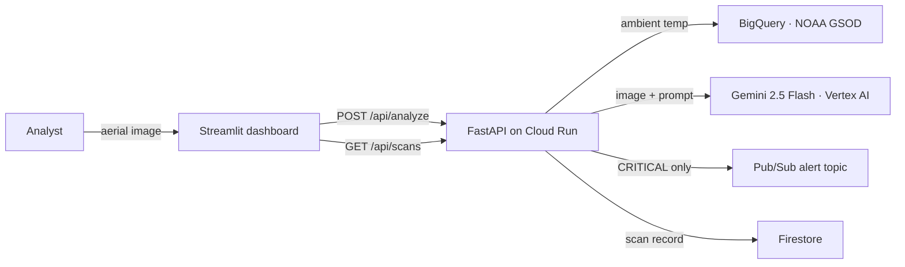

# HotSpot Sentinels

**Google Cloud AI Builder Cup — Sustainability and Social Impact**

Cities trap heat. Asphalt, dark roofs and missing tree canopy can push a neighbourhood several degrees above the city around it, and the people living in those blocks carry the health cost. Finding which blocks, and knowing what to do about them, normally takes a survey team.

HotSpot Sentinels does it from an aerial photograph. It sends the image and the local ambient temperature to **Gemini 2.5 Flash on Vertex AI**, scores a **Heat Vulnerability Index**, returns a costed passive-cooling plan — shade corridors, cool-roof coatings, ventilation alignment — and publishes a Pub/Sub alert the moment a zone crosses into CRITICAL.

## What it produces

Upload an aerial image to `POST /api/analyze` and you get a Heat Analysis Result:

```json
{
  "zone_id": "SG-TOA-07",
  "zone_name": "Toa Payoh Industrial Spur",
  "coordinates": { "lat": 1.3521, "lng": 103.8198 },
  "ambient_temp_c": 31.0,
  "hvi_score": 8.6,
  "risk_level": "CRITICAL",
  "surface_breakdown": { "asphalt_pct": 55, "dark_roof_pct": 30, "concrete_pct": 10, "green_canopy_pct": 5 },
  "passive_cooling_plan": {
    "corridor_orientation": "NE-SW (aligned with prevailing monsoon winds)",
    "retroreflective_coating_sqm": 4200,
    "micro_canopy_interventions": ["Plant shade corridors along west-facing asphalt"],
    "projected_surface_temp_drop_c": 6.8
  },
  "alert_dispatched": true,
  "climate_source": "bigquery",
  "timestamp": "2026-10-02T10:45:28+00:00"
}
```

`risk_level` is always derived from `hvi_score` **in code**, never taken from the model:

| HVI score | risk_level | Behaviour                                                                                     |
| --------- | ---------- | --------------------------------------------------------------------------------------------- |
| < 4.0     | `LOW`      | —                                                                                             |
| 4.0–5.9   | `MODERATE` | —                                                                                             |
| 6.0–7.9   | `HIGH`     | —                                                                                             |
| ≥ 8.0     | `CRITICAL` | publishes a Pub/Sub alert; `alert_dispatched` reflects whether the publish actually succeeded |

`climate_source` tells you where `ambient_temp_c` came from — `bigquery` (live NOAA GSOD telemetry), `fallback` (offline), or `caller` (a what-if override). A what-if number is never presented as measured telemetry.

## Try it without a Google Cloud account

The whole test suite and the container run with **no credentials**:

```bash
uv sync --group frontend --group dev          # or: pip install -r requirements.txt
pytest                                        # 685 tests, fully offline

# Build either image: both run as a non-root user and need no credentials.
docker build -f backend/Dockerfile backend
docker build -f frontend/Dockerfile frontend
```

The climate service degrades to a clearly labelled fallback reading when BigQuery is unreachable, so the pipeline still demonstrates end to end offline.

## Run it against Google Cloud

```bash
cp .env.example .env            # ./setup_gcp.sh writes the real .env for you
./setup_gcp.sh                  # provisions APIs, bucket, Pub/Sub topic, Firestore
python backend/verify_setup.py  # Vertex AI connectivity check; exits non-zero on failure

(cd backend && uvicorn main:app --reload --port 8080)
streamlit run frontend/app.py
```

## What is verified

|                  |                                                                                                                                                                                                                                                                                                           |
| ---------------- | --------------------------------------------------------------------------------------------------------------------------------------------------------------------------------------------------------------------------------------------------------------------------------------------------------- |
| Tests            | **685 passing**, every one offline with mocked cloud clients                                                                                                                                                                                                                                              |
| Backend coverage | **98.2%**, no file below the 70% per-file floor                                                                                                                                                                                                                                                           |
| Schema drift     | a standing cross-layer gate statically fails the build if the analyzer, the API and the dashboard disagree                                                                                                                                                                                                |
| Containers       | both multi-stage and non-root (uid 10001), honouring the `PORT` Cloud Run injects, with no credentials or build tooling in either image                                                                                                                                                                   |
| Deploy           | one script builds, deploys and verifies **both** services, each with its own build context and its own health endpoint                                                                                                                                                                                    |
| Runtime identity | a dedicated `hotspot-run` service account with six narrow roles — no `roles/editor`, no `roles/owner`, and zero key files                                                                                                                                                                                 |
| Live             | deployed to Cloud Run in `asia-southeast1`; the industrial sample returns **HVI 8.1 → CRITICAL** with a published Pub/Sub alert, and a Botanic Gardens coordinate analysis returns **HVI 1.5 → LOW** from live Google satellite imagery — both with NOAA telemetry at 31.0 °C and contract-valid payloads |

## Dependencies

`pyproject.toml` and `uv.lock` are authoritative. Both `requirements.txt` files are **generated exports** — never edit them by hand; each carries a header with its exact regeneration command.

```bash
uv lock
uv export --locked --group frontend --group dev --no-hashes --no-emit-project --output-file requirements.txt
uv export --locked --no-dev --no-hashes --no-emit-project --output-file backend/requirements.txt
```

Streamlit lives in the `frontend` dependency group; backend packages stay in `[project.dependencies]`. The root export carries `frontend` and `dev`, so `pip install -r requirements.txt` still sets up backend, dashboard and tests in one step. The backend export excludes the frontend tree, which is what keeps the backend image at 432 MB rather than 899 MB; the frontend image is 159 MB. Packages genuinely shared with the runtime, such as `httpx` and `requests`, stay in the image.

## Architecture



Data flows one way. `main.py` is the only HTTP layer and the only orchestrator; modules under `services/` and `tools/` never import `main` or each other, and a static test fails the build if they do.

| Layer                          | Responsibility                                                                            |
| ------------------------------ | ----------------------------------------------------------------------------------------- |
| `services/vision_analyzer.py`  | Gemini multimodal analysis; owns the HVI rubric and derives `risk_level` from `hvi_score` |
| `tools/climate_service.py`     | NOAA GSOD ambient temperature, parameterised query, labelled offline fallback             |
| `services/alert_dispatcher.py` | Pub/Sub alert for CRITICAL zones; returns a message id, never raises into the request     |
| `services/database.py`         | Firestore `hotspot_scans` persistence and history                                         |
| `frontend/app.py`              | Presentation only — renders what the API returns, converts nothing                        |

Every cloud dependency degrades rather than fails: BigQuery falls back to a labelled reading, a failed Pub/Sub publish still returns a successful analysis with `alert_dispatched: false`, and Firestore unavailability surfaces as a 503 rather than a silent empty result.

## API client guide

Three endpoints. Errors share one shape: `{"code": "...", "message": "..."}`.

```bash
curl -X POST "$API/api/analyze" \
  -F "file=@aerial.jpg;type=image/jpeg" \
  -F "zone_id=SG-TOA-07" \
  -F "zone_name=Toa Payoh Industrial Spur" \
  -F "lat=1.3521" -F "lng=103.8198" \
  -F "ambient_temp_c=36.5"
```

| Field                  | Required | Rules                                                                                                        |
| ---------------------- | -------- | ------------------------------------------------------------------------------------------------------------ |
| `file`                 | yes      | JPEG or PNG, **and the bytes must really be one** — a mismatched signature is rejected. Max 10,000,000 bytes |
| `zone_id`, `zone_name` | no       | non-blank when supplied; passed through verbatim and never overridden by the model                           |
| `lat`, `lng`           | no       | −90..90 and −180..180. Either may be supplied alone; the other is inferred                                   |
| `ambient_temp_c`       | no       | −50..60 °C. Supplying it skips the telemetry lookup and sets `climate_source: caller`                        |

Anything you omit is inferred by Gemini, and `identity_source` tells you per field which is which — so an inferred coordinate is never mistaken for one you provided.

| Status | Meaning                                                        |
| ------ | -------------------------------------------------------------- |
| `200`  | analysis complete; body is a Heat Analysis Result              |
| `413`  | upload above the size limit                                    |
| `415`  | not a JPEG or PNG, or the bytes do not match the declared type |
| `422`  | a supplied field failed validation                             |
| `502`  | the analysis model is unavailable                              |
| `503`  | scan storage is unavailable                                    |

`GET /api/scans?limit=N` returns recent scans newest-first, `limit` clamped to 1..100. `GET /api/health` reports per-dependency readiness; `GET /api/live` is a cheap liveness check with no cloud calls — use that one for container restart probes.

All temperatures are °C and all areas are m². Conversion happens at the source, never at the client.

## Configuration

Every value comes from the environment, never from a literal in source. [.env.example](.env.example) is the template; `./setup_gcp.sh` writes the real `.env`, which is git-ignored and must never be committed.

| Variable                             | Default                  | Used by                                             |
| ------------------------------------ | ------------------------ | --------------------------------------------------- |
| `GOOGLE_CLOUD_PROJECT`               | — (required)             | all cloud clients                                   |
| `GOOGLE_CLOUD_REGION`                | `asia-southeast1`        | genai, Cloud Run                                    |
| `GCS_BUCKET_NAME`                    | `${PROJECT}-data`        | seeder, storage                                     |
| `PUBSUB_TOPIC_ID`                    | `heat-resilience-alerts` | alert dispatcher                                    |
| `BIGQUERY_LOCATION`                  | `US`                     | climate service — the one ratified region exception |
| `GOOGLE_MAPS_API_KEY`                | — (required, **secret**) | Maps Static API                                     |
| `GOOGLE_MAPS_REQUEST_LIMIT`          | `100`                    | Maps cache-miss budget per rolling window           |
| `GOOGLE_MAPS_REQUEST_WINDOW_SECONDS` | `3600`                   | Maps cache-miss budget window in seconds            |
| `MODEL_ID`                           | `gemini-2.5-flash`       | vision analyzer                                     |
| `ALLOWED_ORIGINS`                    | `http://localhost:8501`  | FastAPI CORS                                        |
| `API_BASE_URL`                       | `http://localhost:8080`  | Streamlit dashboard → backend                       |
| `PORT`                               | `8080`                   | uvicorn, Cloud Run                                  |

Authentication is Application Default Credentials. There are no service-account key files anywhere in this project.

### How the Maps key is protected

`GOOGLE_MAPS_API_KEY` is the only true secret in the configuration, and it is handled differently from everything else:

| Context           | Where it lives                                                    | Who can read it                                                                    |
| ----------------- | ----------------------------------------------------------------- | ---------------------------------------------------------------------------------- |
| Local development | `.env`, git-ignored                                               | you only                                                                           |
| Git / GitHub      | **nowhere** — `.env.example` carries the name with an empty value | nobody                                                                             |
| Cloud Run         | **Secret Manager** (`hotspot-maps-api-key`), mounted at runtime   | only `hotspot-run`, via `roles/secretmanager.secretAccessor` on that single secret |

It is deliberately **not** passed with `--set-env-vars`, because an environment variable's value is plainly visible to anyone holding `run.services.get` on the project. Mounting it with `--set-secrets` keeps the value out of the service definition, out of `gcloud run services describe`, and out of the Cloud Console. `tests/test_deploy_script.py` fails the build if it ever reappears as a plain environment variable.

Restrict the key to the Maps Static API and approved referrers/IP addresses; never deploy an unrestricted key. The backend never returns it to the browser, logs it, or includes it in an error — a request that cannot be served fails with a generic `imagery_unavailable`.

The Maps request budget counts cache-miss attempts per process in a rolling window; cache hits do not consume it. This is a per-process defensive budget, not a service-wide spend cap: Cloud Run instances each have an independent allowance, so N instances can collectively consume N × the configured limit per rolling window. Aggregate quota enforcement remains an unresolved operational requirement.

## Container and deploy

Each service builds from **its own directory as the build context**, not the repository root. `backend/Dockerfile` copies `requirements.txt`, `main.py`, `services/` and `tools/` relative to `backend/`; `frontend/Dockerfile` copies `app.py` relative to `frontend/`. Each directory has its own `.dockerignore`.

```bash
# Build and run either image locally.
docker build --platform linux/amd64 -f backend/Dockerfile -t hotspot-backend backend
docker run --rm -e PORT=9090 -e GOOGLE_CLOUD_PROJECT="$PROJECT" hotspot-backend

docker build --platform linux/amd64 -f frontend/Dockerfile -t hotspot-frontend frontend
docker run --rm -e PORT=9091 -e API_BASE_URL="$BACKEND_URL" hotspot-frontend
```

`--platform linux/amd64` matters: Cloud Run rejects an arm64 image, which an Apple-silicon host produces by default.

Deploy both services with one command. It builds, pushes, deploys and then verifies each service **separately** — backend on `/api/health`, frontend on `/_stcore/health` — because a passing backend is not evidence that the dashboard works:

```bash
bash .github/skills/cloudrun-deploy/scripts/deploy.sh
```

The script tags images with the git SHA, injects runtime configuration as environment variables, pins the `hotspot-run` service account, and refuses to ship if `GOOGLE_MAPS_API_KEY` is unset. `tests/test_deploy_script.py` lints it offline so the build context, platform pin, service name and injected variable set cannot drift.

Both images are multi-stage and run as the non-root user `sentinel` (uid 10001), carrying no build tooling, tests or credentials.

### Runtime permissions

The services run as `hotspot-run@PROJECT.iam.gserviceaccount.com` with exactly six roles and no key file:

`roles/aiplatform.user`, `roles/datastore.user`, `roles/pubsub.publisher`, `roles/pubsub.viewer`, `roles/bigquery.jobUser`, `roles/storage.objectViewer`

`pubsub.viewer` is needed in addition to `publisher` because `/api/health` calls `get_topic`, which `publisher` alone does not permit. Without it the service reports `degraded` while publishing still works.

It additionally holds `roles/secretmanager.secretAccessor` **scoped to the single `hotspot-maps-api-key` secret**, not granted at project level. That is what lets the revision read the Maps key at startup without any identity — including the deployer — needing broad secret access.

### Rollback

Roll back by shifting traffic, never by deleting the service:

```bash
gcloud run services update-traffic hotspot-backend --region asia-southeast1 --to-revisions <previous>=100
gcloud run services update-traffic hotspot-backend --region asia-southeast1 --to-latest
```

## Layout

```
backend/
  main.py                  FastAPI controller — the only HTTP layer
  services/
    vision_analyzer.py     Gemini multimodal analysis (async)
    alert_dispatcher.py    Pub/Sub critical alerts
    database.py            Firestore 'hotspot_scans' persistence
  tools/
    climate_service.py     BigQuery NOAA GSOD telemetry + offline fallback
    seed_samples.py        Synthetic aerial test imagery
  verify_setup.py          Vertex AI connectivity smoke test
frontend/app.py            Streamlit dashboard
tests/                     pytest suite
data_samples/              Generated test images (git-ignored)
```

## Import strategy

One rule decides how every module is imported, and it is configured once in [pyproject.toml](pyproject.toml):

```toml
[tool.pytest.ini_options]
pythonpath = ["backend"]
testpaths = ["tests"]
```

`pythonpath = ["backend"]` makes `import services.vision_analyzer` and `import tools.climate_service` resolve from the repository root exactly as they do under `uvicorn main:app` started from `backend/`. The same import statement therefore works in the editor, under pytest, and in the Cloud Run container.

Consequences worth knowing:

- **No `sys.path` manipulation anywhere.** No `sys.path.append`, no `sys.path.insert`, and no `conftest.py` that mutates the path. `tests/test_package_layout.py::test_no_sys_path_manipulation` fails the build if one appears.
- **`testpaths = ["tests"]`** keeps collection out of `backend/`, so no script placed there can be auto-collected and make live cloud calls during a test run. The former ad-hoc scripts `backend/test_analyzer.py` and `backend/test_pipeline.py` were retired in sprint 7; their coverage now lives in the opt-in `pipeline-smoke-test` workflow, and `tests/test_foundation.py::test_no_cloud_calling_scripts_live_under_backend` fails the build if either returns.
- **Layering is one-way.** `main` orchestrates; modules under `services/` and `tools/` import neither `main` nor each other. A service must not import a sibling service, and a tool must not import a service. `tests/test_package_layout.py::test_service_layer_does_not_import_main` enforces this.

## Tests

```bash
pytest                                                    # whole suite, no credentials needed
python3 .github/skills/agile-sdlc-loop/scripts/sprint_report.py   # suite + coverage report
```

Every test runs offline. Gemini, Firestore, Pub/Sub, BigQuery and Cloud Storage clients are mocked — a test that needs a real cloud call is a broken test.

## Continuous integration

Every push and pull request runs five independent checks, all without cloud credentials:

| Check                                    | What it guards                                       |
| ---------------------------------------- | ---------------------------------------------------- |
| Offline suite and coverage floor         | 685 tests plus a per-file 70% floor                  |
| Generated dependency exports are current | the three `requirements.txt` exports match `uv.lock` |
| Build backend image                      | `backend/Dockerfile`, `linux/amd64`                  |
| Build frontend image                     | `frontend/Dockerfile`, `linux/amd64`                 |
| Secret scan                              | gitleaks over the working tree and full history      |

The two image builds are separate jobs with `fail-fast` disabled, so a passing backend image can never mask a failing frontend one.

`main` is protected by a ruleset that requires all five checks before a pull request can merge, and forbids force pushes. Approvals are not required because a solo maintainer cannot approve their own pull request; the checks are the gate.

## Known limitations

Three items are deliberately open. Each needs a human decision or unimplemented feature work — none is a defect, and none is something the delivery loop can honestly close on its own.

| Item        | What is missing                             | Why it is still open                                                                                                                                                                                                                                                                                                                                                       |
| ----------- | ------------------------------------------- | -------------------------------------------------------------------------------------------------------------------------------------------------------------------------------------------------------------------------------------------------------------------------------------------------------------------------------------------------------------------------- |
| `TASK-006`  | the demo recording                          | Everything else in the submission package is done and evidenced: the repository is public with no secrets in history, the deployed URL is reachable, and the contract audit is clean. Only the 3-minute video is outstanding, and it needs a person. See [demo-runbook.md](.github/docs/demo-runbook.md) and [docs/submission-checklist.md](docs/submission-checklist.md). |
| `STORY-031` | scan records linked to retained imagery     | `TASK-046` introduced durable imagery storage under deterministic prefixes, but a scan record still carries no object URI, so you cannot retrieve the exact image a given scan used. The storage path now exists; the linkage does not.                                                                                                                                      |
| `TASK-011`  | correction of protected foundation specs    | `COPILOT_GUIDE.md` and `Epics_Stories.md` are human-owned and carry statements that predate later ratified decisions. They need an editor with authority over those documents.                                                                                                                                                                                             |

### Recently closed

- **`STORY-043`** — releases deploy from GitHub Actions via Workload Identity Federation. Pushing a `vMAJOR.MINOR.PATCH` tag builds, deploys and verifies both services with no service-account key anywhere, and the gate refuses to ship a commit that is not on `main` with all five checks green.
- **`TASK-046`** — the Maps imagery cache is shared across instances through Cloud Storage. Verified live: a brand-new revision served a valid 640×640 PNG that a *different* instance had fetched, where previously that returned 502. `--max-instances=1` is no longer needed for the demo.

## Delivery process

Sprint state lives in [agile/backlog.json](agile/backlog.json), requirements in [agile/requirements.md](agile/requirements.md), and sprint reports in `agile/reports/`.
